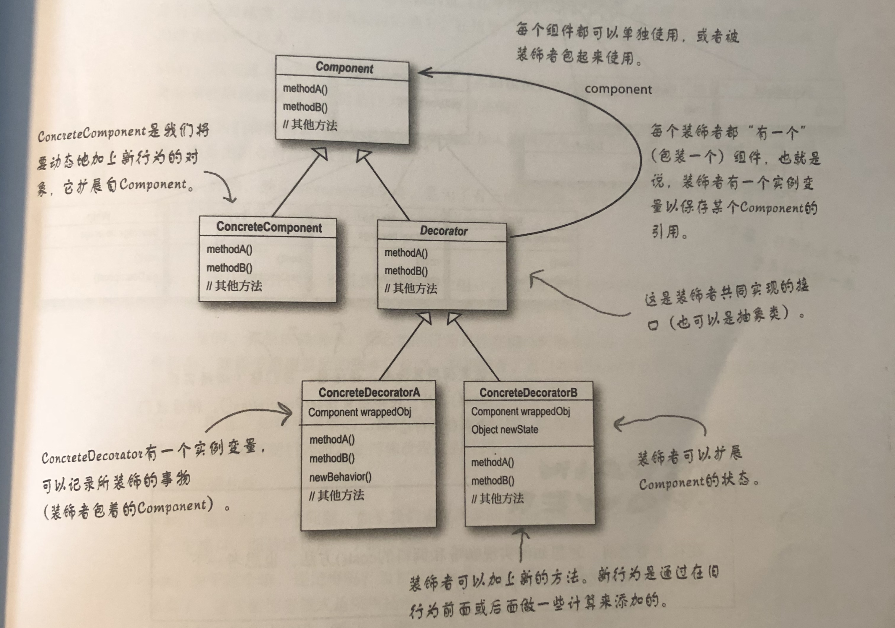
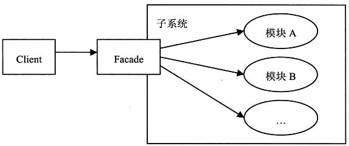
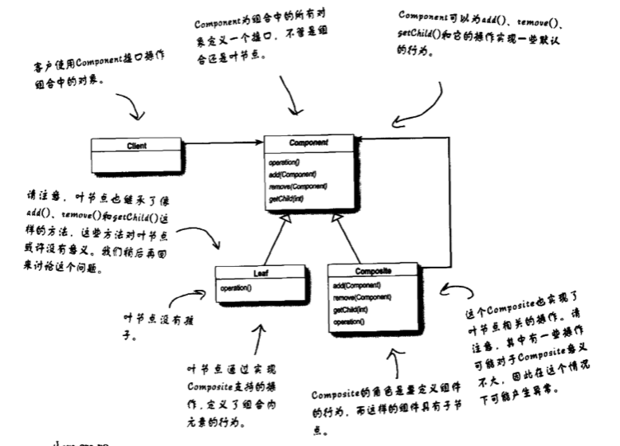

# 设计模式回顾

## 策略模式（Strategy Pattern）

### 定义

策略模式定义了算法族，分别封装起来，让它们之间可以互相替换，此模式让算法的变化独立于使用算法的客户

### 类图


## 观察者模式（Observer Pattern）

### 定义

观察者模式定义了对象之间的一对多依赖，这样一来，当一个对象改变状态时，它的所有依赖者都会收到通知并自动更新

### 类图


### 装饰者模式（Decorator Pattern）

### 定义

装饰者模式动态地将责任附加到对象上。若要扩展功能，装饰者提供了比继承更有弹性的替代方案

### 类图



## 简单工厂模式


## 工厂方法模式（Factory Method Pattern）

### 定义

工厂方法模式定义了一个创建对象的接口，但由子类决定要实例化的类是哪一个。工厂方法让类把实例化推迟到子类

### 类图


## 抽象工厂模式（Abstract Factory Pattern）

[https://www.jianshu.com/p/d27d698802fd](https://www.jianshu.com/p/d27d698802fd)

### 定义

抽象工厂模式提供一个接口，用于创建相关或依赖对象的家族，而不需要明确指定具体类

### 类图


## 单例模式（Singleton Pattern）

### 定义

单例模式确保一个类只有一个实例，并提供一个全局访问点

### 类图


## 命令模式（Command Pattern）

### 定义

命令模式将“请求”封装成对象，以便使用不同的请求、队列或者日志来参数化其他对象。命令模式也支持可撤销的操作

### 类图


```java
public void execute() {
    receiver.action();
}
```

## 适配器模式（Adapter Pattern）

### 定义

适配器模式将一个类的接口，转换成客户期望的另一个接口。适配器让原本接口不兼容的类可以合作无间。


## 外观模式（Facade Pattern）

### 定义

外观模式提供了一个统一的接口，用来访问子系统中的一群接口。外观定义了一个高层接口，让子系统更容易使用

### 类图



## 迭代器模式（Iterator Pattern）

### 定义

迭代器模式提供一种方法顺序访问一个聚合对象中的各个元素，而又不暴露其内部的表示

### 类图


## 组合模式（Composite Pattern）

### 定义

组合模式允许你将对象组合成树形结构来表现“整体/部分层次结构。组合能让客户以一致的方式处理个别对象以及对象组合。

### 类图



