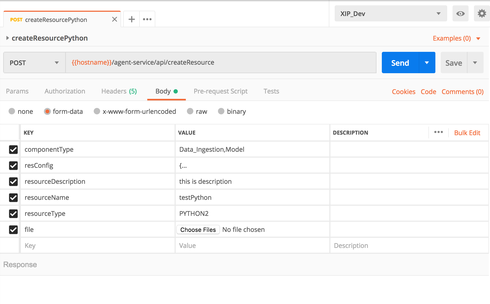

# How to create resource via APIs

\[C_onfluence Guide_!\]\([https://nis.pwcinternal.com/confluence/pages/editpage.action?pageId=70058843](https://nis.pwcinternal.com/confluence/pages/editpage.action?pageId=70058843)\)

**resourceType selections:**

| Selections | Description |
| :--- | :--- |
| SPARK\_ONE\_DOT\_SIX\_PYTHON\_2 | Spark 1.6 + Python 2.x |
| SPARK\_TWO\_PYTHON\_2 | Spark 2.0 + Python 2.x |
| SPARK\_TWO\_PYTHON\_3 | Spark 2.0 + Python 3.x |
| SPARK\_ONE\_DOT\_SIX\_R | Spark 1.6 + R |
| SPARK\_TWO\_R | Spark 2.0 + R |
| SPARK\_ONE\_DOT\_SIX\_SCALA | Spark 1.6 + Scala/Java |
| SPARK\_TWO\_SCALA | Spark 2.0 + Scala/Java |
| PYTHON2 | Python 2.7x |
| PYTHON3 | Python 3.6x |
| R | R 3.1x |
| PENTAHO | Pentaho |
| RULES | Rules |

**ComponentType Selections:**

| **selections** |
| :--- |
| Data\_Ingestion |
| Data\_Preparation |
|  Model |
| Post\_Model\_Data\_Preparation |

**resConfig examples:**

\*\*\*\*

<table>
  <thead>
    <tr>
      <th style="text-align:left">Resource Type</th>
      <th style="text-align:left">Config Example</th>
    </tr>
  </thead>
  <tbody>
    <tr>
      <td style="text-align:left">Spark</td>
      <td style="text-align:left">
        
{

        
&quot;mainClass&quot;: &quot;mainClass&quot;,

        
&quot;sparkConf&quot;: {

        
&quot;sck1&quot;: &quot;scv1&quot;

        
},

        
&quot;packages&quot;: [&quot;p1&quot;,&quot;p2&quot;],

        
&quot;supPyRes&quot;: [&quot;sp1&quot;,&quot;sp2&quot;],

        
&quot;supJars&quot;: [&quot;sj1&quot;,&quot;sj2&quot;],

        
&quot;appArgs&quot;: [&quot;a1&quot;,&quot;pa2&quot;],

        
&quot;sparkArgs&quot;: {

        
&quot;sak1&quot;: &quot;sav1&quot;

        
}

        
}

      </td>
    </tr>
    <tr>
      <td style="text-align:left">Rules</td>
      <td style="text-align:left">
        
{

        
&quot;params&quot;:{

        
&quot;pk1&quot;: &quot;pv1&quot;,

        
&quot;pk2&quot;: &quot;pv2&quot;

        
}

        
}

      </td>
    </tr>
    <tr>
      <td style="text-align:left">R</td>
      <td style="text-align:left">
        
{

        
&quot;packages&quot;: [&quot;p1&quot;,&quot;p2&quot;],

        
&quot;supRes&quot;: [&quot;s1&quot;, &quot;s2&quot;],

        
&quot;appArgs&quot;: [&quot;a1&quot;, &quot;a2&quot;]

        
}

      </td>
    </tr>
    <tr>
      <td style="text-align:left">Python</td>
      <td style="text-align:left">
        
{

        
&quot;packages&quot;: [&quot;p1&quot;,&quot;p2&quot;],

        
&quot;supRes&quot;: [&quot;s1&quot;, &quot;s2&quot;],

        
&quot;appArgs&quot;: [&quot;a1&quot;, &quot;a2&quot;]

        
}

      </td>
    </tr>
    <tr>
      <td style="text-align:left">Pentaho</td>
      <td style="text-align:left">
        
{

        
&quot;params&quot;:{

        
&quot;pk1&quot;: &quot;pv1&quot;,

        
&quot;pk2&quot;: &quot;pv2&quot;

        
}

        
}

      </td>
    </tr>
  </tbody>
</table>