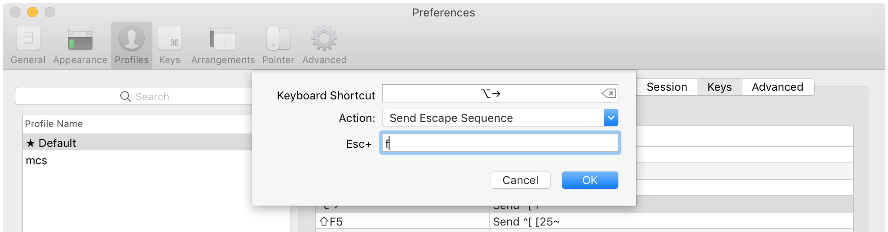
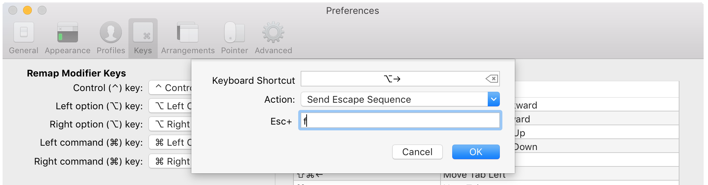

# Iterm

Using Alt/Cmd + Right/Left Arrow in iTerm

Go to iTerm Preferences → Profiles, select your profile, then the Keys tab. Find ⌥← and ⌥→ and set them to send escape sequence b and send escape sequence f respectively

If you use ⌘→ and ←⌘ you will need to remap the next and previous tab shortcuts which are set to those as default. Terminal uses ⇧⌘→ and ⇧⌘← for these.You can do this under Profiles, or just globally under Keys \(shown below\) if you wish to set it globally. Note that settings in Profiles override global settings in Keys

