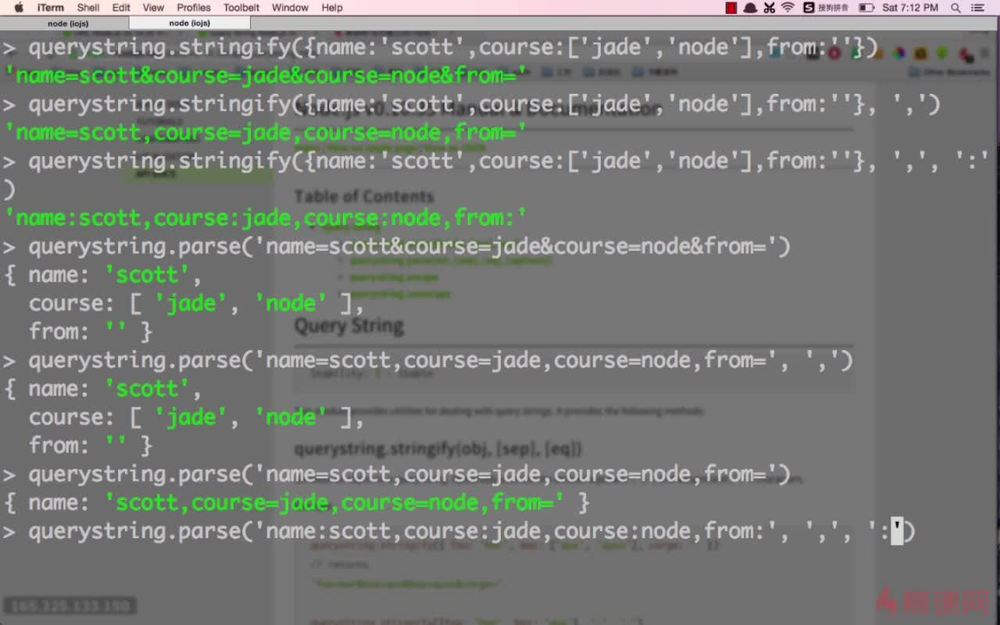

# querystring参数处理

参数序列化：querystring.stringify\(\)。  
第一个参数是一个对象，传递的数据；第二个参数是分隔符默认为&；key与value之间的等号可以换成什么值或者符号

参数反序列化：querystring.parse\(\)。

  
转义：querystring.escape\(\)。  
反转义：querystring.unescape\(\)。

